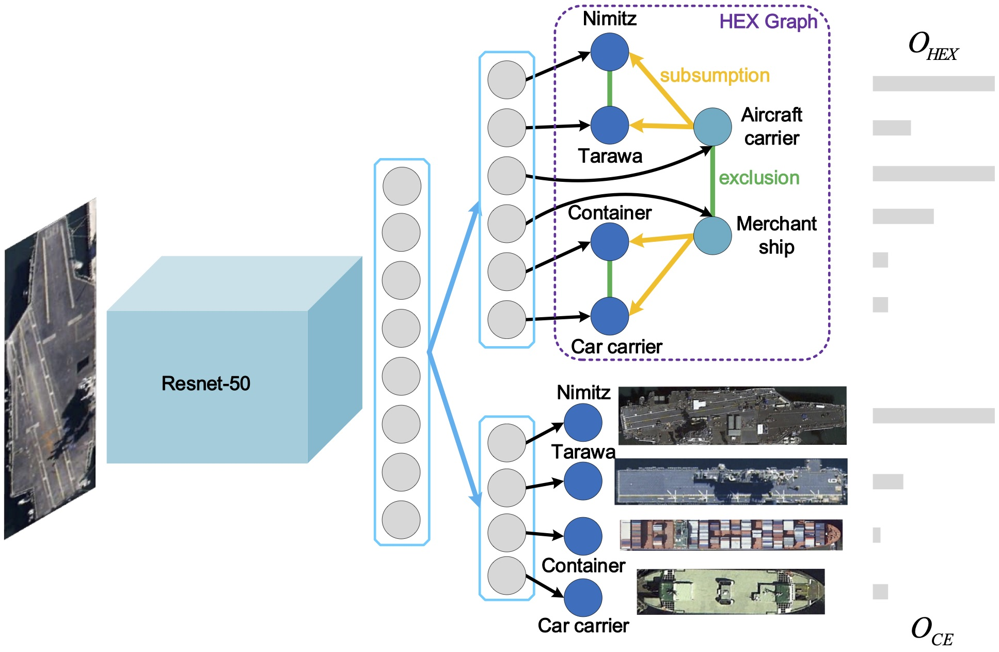

# HMC
This repo is a implementation for paper *Hierarchical Multilabel Ship Classification in Remote Sensing Images Using Label Relation Graphs* that has been accepted by TGRS2021.

## [Paper](https://ieeexplore.ieee.org/document/9538966)

## Network Architecture

## Requirements
* Python 3.6.8
* Pytorch 1.2.0
* torchvision 0.4.0
* CUDA 10.2
* Supporting files for CUB-200-2011 can be found in [HRN](https://github.com/MonsterZhZh/HRN)

